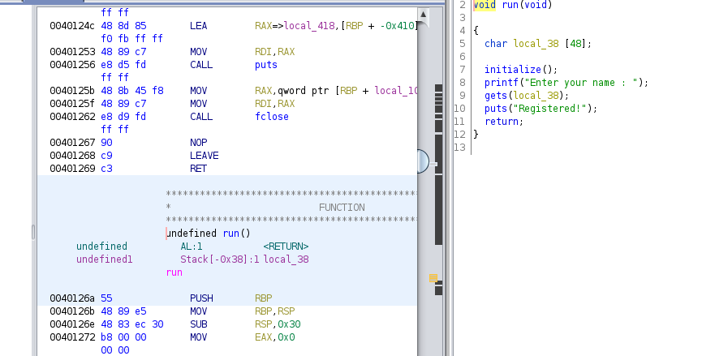
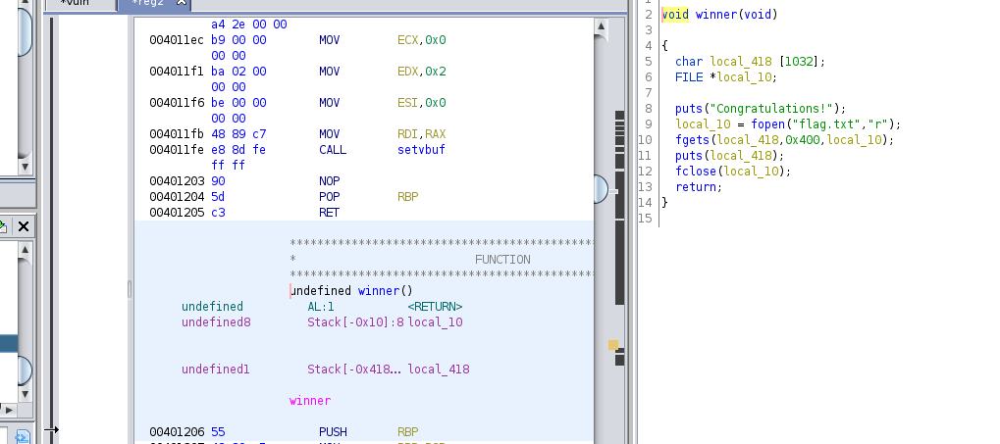
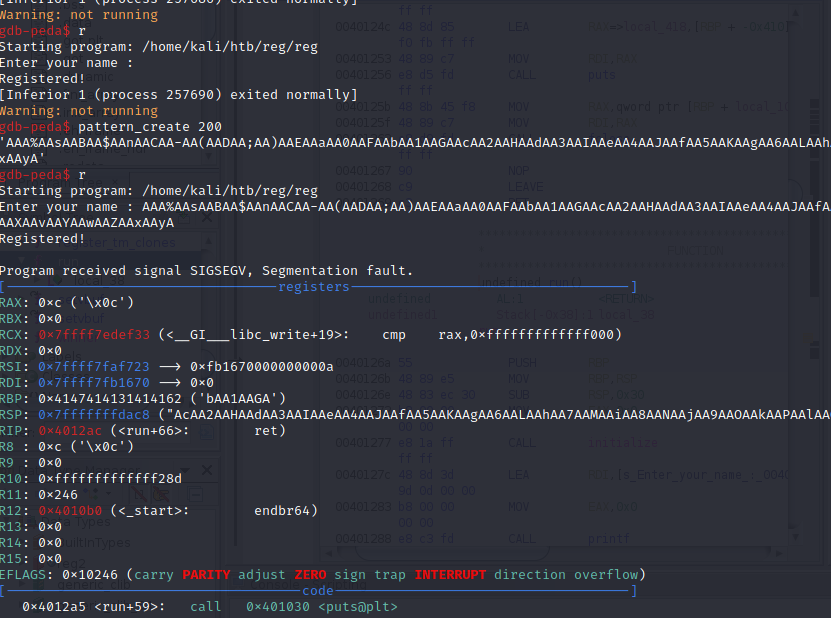
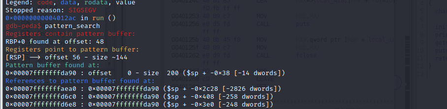
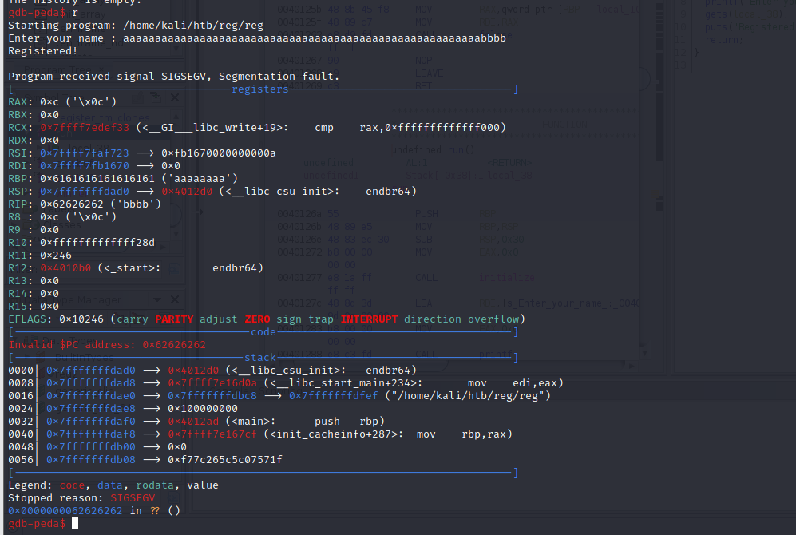
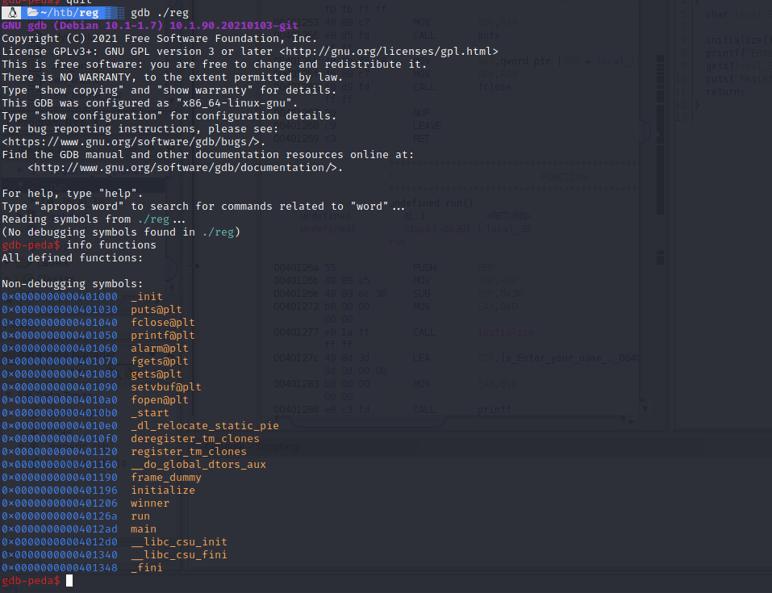

Main resources used : https://www.youtube.com/watch?v=72GShSHsRZI : Pink Draconian : Hack The Box - Introduction to Binary Exploitation - Reg - Walkthrough

This is a exploitation technique used in Buffer Overflows and by malicious outsiders to execute code on target systems.


This attack is basically mostly done when we have NX secuirty enabled due to which we wont be able to execute our shellcode soo we have to analyse the flow of the functions and basically return functions to our advantage to take control of functions in the binary to get us remote code execution.Ideally many times what we can do is abuse the libc library for this which is very well known and it is possible to identify memory addresses we can call to craft a payload that wont mess up the buffer and execute what we want it to.

But in many CTF's we have functions we can take over functions that we can analyse with Ghidra/gdb to get information about addresses we can redirect our controlled EIP too , to get execute the Function. 

#### Example : Reg 

Here we can see this is a super simple CTF the first thing to do here would be to analyse the binary in gdb/ghidra .

Here if we analyse the Binary in Ghidra we see that there is 4 functions : main, run,intialize winner . After analysing the code we can see the main fucntion runs the run function which is using initialize function to initializing variables  and using gets function soo we can easily overwrite that as gets is vulnerable to Buffer Overflow attacks.





So lets try opening the file in gdb and analyse where the EIP is to do this we can use the pattern_create and pattern_search built into gdb-peda like so : 





Also to confirm if the RIP address we got is correct we can try overwritting it and i did that by printing 56 "a" and added 4 b to overwrite the RIP and we were succesful .



Now lets reload the file in gdb (helps avoid the extra functions added in the binary after execution) and do info functions to see where the address is for the Winner function which we have to execute to get our shell.



and here now we see the address is `0x0000000000401206` but due to Little endian in our payload we gotta reverse it you can use libraries like pwntools, struct for it i just reversed it manually and our payload would be something like this :

```python
padding = 56 * b"a"
address = b"\x06\x12\x40\x00\x00\x00\x00\x00"
payload = padding + address 
print(payload)
```

We can now transfer this output to a file and then send this to our netcat session like so .

```bash
python exploit.py > payload.txt
nc remoteip remoteport < payload.txt
```