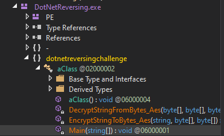
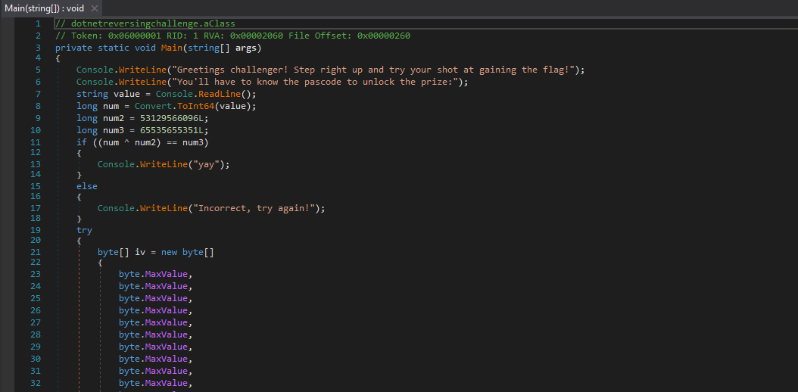
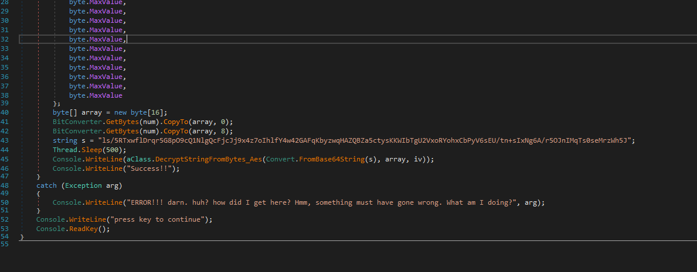
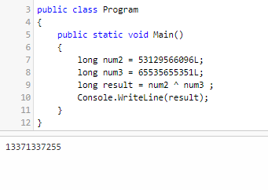
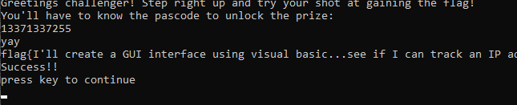

This is a fairly basic reversing challenge which deals with basic C# Reversing and decompiling binaries written in C#.

For this we can use tools like DNSpy which can be downloaded from here : [](https://github.com/dnSpy/dnSpy/releases/tag/v6.1.8)[https://github.com/dnSpy/dnSpy/releases/tag/v6.1.8](https://github.com/dnSpy/dnSpy/releases/tag/v6.1.8) and then download the version for your OS and unzip it and thats it.

Now lets load binary in dnSpy using the File option and selecting the EXE. Here we see there are three functions when the binary loads up :



and we will be most intrested in the main function at first and analysing whats that function doing




and here we can see that there is a if/else statement and a try/catch if that if statement matches and when we analyse the it seems its gonna ask for a input of sorts and that input is called num and the if statement is if ((num ^ num2) == num3) then we have to somehow find out what world be the input to match this if statement.

Here it says : num3 = num ^ num2 so num = num2 ^ num3 and we have the values for num2 and num3 so lets use an online compiler to find this value here is the code :

```csharp
using System;
					
public class Program
{
	public static void Main()
	{
		long num2 = 53129566096L;
		long num3 = 65535655351L;
		long result = num2 ^ num3 ;
		Console.WriteLine(result);
	}
}
```

This is the online compiler i used : [](https://dotnetfiddle.net/)[https://dotnetfiddle.net/](https://dotnetfiddle.net/)



Here we can now just run the program and use this number and get the flag easy peasy.

P.S. decompyling and modyifying the C# program's if statement to avoid the condition wont work here as its gonna give us a error in Catch statement as we need the num value to decode the string which has the flag.



We can also use breakpoints in dnSpy to see the variables at a certain point and just locally set variables that way soemetimes.