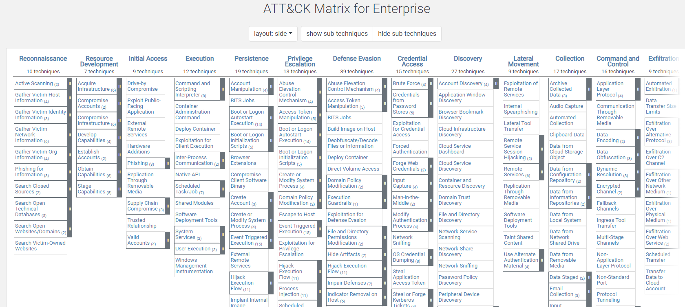

```
Resource Used : https://tryhackme.com/room/mitre
```


### Basic Terminology: 

APT : Advanced Persistent Threat which can be a team/group or even nation state group that engages in long-term attack against organization/countries.

TTP : Techniques, Tactics and Procedure : 
Tactic : Goal or Objective 
Technique : How they achieve the goal
Procedure : How the technique is executed.

### Attack Framework: 

This is a globally accesible knowledge base of advesary TTs based on real life observations executed by APTs. Its a resource that a lot of people in the industry contribute to and maintain :



Here there are 14 main categories , which contain the techniques (which then contain subcategories sometimes if needed) which the adversary could use to perform the tatic. If we want to get more information we can just click on the topic which will give us a brief description, Proceure examples and mitigations.

